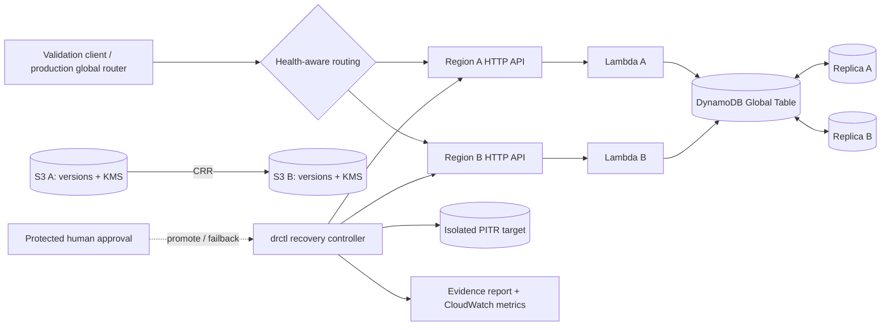

# Multi-Region Disaster Recovery & Recovery Validation Platform

[](https://github.com/OWNER/multiregion-disaster-recovery-platform/actions/workflows/ci.yml)

A synthetic, serverless portfolio reference for operating an **active-active AWS application**
across two regions and recovering safely from two materially different failures:

1. a regional service outage while the surviving region continues reads and writes; and
2. logical data corruption requiring DynamoDB PITR into an isolated target, validation,
   explicit approval, and controlled reconciliation.

It also validates versioned, KMS-encrypted S3 supporting objects and cross-region replicas.
The core claim is narrow: recovery is complete only after observed service and data correctness
checks pass. `drctl` calculates RTO/RPO from event timestamps; it never turns a Terraform success
into recovery evidence.

> **Milestone 1 status:** architecture and locally testable implementation only. No AWS resources
> have been created and the checked-in evidence is explicitly local/synthetic—not an AWS PASS.

## What is engineered here

- Active-active Lambda + HTTP API services in `us-east-1` and `us-west-2` (configurable), backed
  by a DynamoDB Global Table with PITR.
- S3 versioning, SSE-KMS, block-public-access, and encrypted cross-region replication with delete
  markers intentionally not replicated.
- Deterministic synthetic transactions and a deterministic local traffic router for outage drills.
  Production uses Route 53 ARC/health-aware DNS or Global Accelerator; the demo does not claim
  equivalence to global DNS/anycast.
- `drctl` recovery control plane with explicit state transitions, isolated restore, deterministic
  checksums/key comparison, freshness and object-version gates, approval evidence, and safe failback.
- Machine-readable `recovery-report.json` with calculated RTO/RPO, record loss, validations,
  approvals, and failback state.
- Independent Terraform ownership for bootstrap, global data, and each regional runtime.
- GitHub Actions OIDC, separate deploy/recovery roles, tests, type/lint checks, Terraform validation,
  workflow lint, IaC scanning, and secret scanning. Cloud plans are manual; apply is absent.

## Architecture at a glance



Detailed and scenario-specific diagrams live in [architecture](docs/architecture.md),
[disaster scenarios](docs/disaster-scenarios.md), and
[recovery orchestration](docs/recovery-orchestration.md).

## Recovery contract

`HEALTHY → INCIDENT_DECLARED → RECOVERY_IN_PROGRESS → VALIDATING → AWAITING_APPROVAL
→ RECOVERY_ACTIVE → FAILBACK_IN_PROGRESS → HEALTHY`

Automation discovers resources, selects/restores data, probes both APIs, compares data and S3
versions, writes a post-recovery transaction, calculates observed metrics, and generates evidence.
Humans must approve promotion, entering failback, and returning to active-active service. Invalid
or skipped transitions fail closed.

## Run locally

Requirements: Python 3.11+, Terraform 1.8+ for IaC validation.

```bash
python3 -m venv .venv
source .venv/bin/activate
python -m pip install -e '.[dev]'
make lint typecheck test
make local-demo
```

The drill creates `evidence/recovery-report.json` from controller state. To exercise commands:

```bash
drctl status
drctl validate
drctl declare --scenario logical-data-corruption --failure-time 2026-01-01T00:00:00Z
drctl recover-data --recovery-point 2025-12-31T23:59:55Z
drctl validate-recovery
drctl promote --approve --approver portfolio-owner --reference LOCAL-DEMO
drctl report
```

Failback is deliberately two-step: `--phase start` and `--phase complete` each require `--approve`,
`--both-regions-healthy`, `--data-consistent`, an approver, and a reference. AWS execution replaces
the local operator flags with controller-collected regional probes.

## Repository map

| Area | Purpose |
|---|---|
| `src/dr_platform` | synthetic API, router, state machine, orchestration, validation, AWS adapters, evidence |
| `terraform/modules` | reusable global data, regional service, and GitHub OIDC modules |
| `terraform/stacks` | independently planned bootstrap/global/Region A/Region B roots |
| `tests` | transition, corruption, checksum, RTO/RPO, routing, approval, failback, evidence tests |
| `docs` | architecture decisions, scenarios, runbook, security, evidence, and cost analysis |
| `examples/supporting-data` | tiny public synthetic objects for S3 recovery validation |
| `.github/workflows` | CI and owner-authorized AWS plan-only workflow |

## Evidence and honest claims

- Local tests prove controller policy and deterministic validation logic.
- Terraform describes intended AWS resources but has not been applied.
- AWS availability, replication latency, restoration duration, and global-table behavior remain
  unverified until Milestone 2 executes an owner-authorized drill.
- No employer/customer design, identifiers, code, data, or operational claims are present.

## Documentation

- [Architecture](docs/architecture.md) · [Scenarios](docs/disaster-scenarios.md) ·
  [Orchestration](docs/recovery-orchestration.md) · [RTO/RPO](docs/rto-rpo.md)
- [Security/threat model](docs/security-threat-model.md) ·
  [Runtime evidence](docs/runtime-evidence.md) · [Cost model](docs/cost-model.md)
- [Production vs demo](docs/production-vs-demo.md) · [Operator runbook](docs/runbook.md) ·
  [ADRs](docs/adr/)

## Destruction and cost warning

Nothing runs automatically. Use a disposable AWS account, set budgets, review plans, and obtain
owner authorization before any apply or drill. DynamoDB PITR restores, replicated storage, KMS
keys, logs, and API calls incur charges. See the [cost model](docs/cost-model.md).
