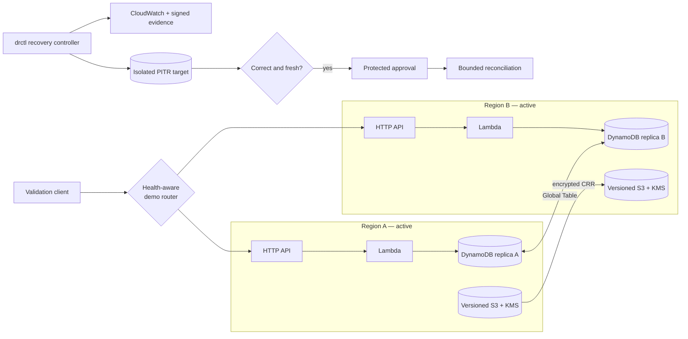

# Multi-Region Disaster Recovery & Recovery Validation Platform

[](https://github.com/Shaharyarzd/multiregion-disaster-recovery-platform/actions/workflows/ci.yml)

A serverless AWS case study that asks a harder question than “did failover work?”:

> Can an active-active application survive a regional endpoint outage, recover safely from logical
> corruption, prove data correctness before promotion, and measure actual RTO/RPO from trusted
> observations?

The implementation uses two regional HTTP APIs and Lambdas, DynamoDB Global Tables with PITR,
versioned S3 with encrypted cross-region replication, KMS, CloudWatch, Terraform, GitHub OIDC, and
a Python recovery controller named `drctl`. All application data is synthetic.

## Runtime proof

Milestone 2 executed the disposable two-region topology in `us-east-1` and `us-west-2`. The final
report was hash-chained, signed with an asymmetric AWS KMS key, verified after exact-version
read-back, and retained under S3 Object Lock.

| Proof | Observed result |
|---|---|
| Regional endpoint outage | **PASS** — survivor read/write continued; safe active-active return |
| Measured routing/service RTO | **0.897355 seconds** |
| DynamoDB cross-region convergence | **837.783 ms** and **1394.320 ms** |
| Logical-corruption recovery | **PASS** — isolated PITR restore and configuration validation |
| PITR restore duration | **901.812355 seconds** |
| Restored data | **8/8 records**, zero missing or unexpected |
| Reconciliation | **21 replayed**, duplicate retry **21/21 idempotent**, two conditional repairs |
| Safety gates | conflicts, incomplete replay, stale validation, and unsafe promotion fail closed |
| S3 CRR and version recovery | **PASS** — observed lag **23.813 seconds**, exact digest/version |
| Controller crash/resume | **PASS** — durable state recovered without duplicate promotion/replay |
| CloudWatch contract | **PASS** — all nine DR metrics accepted and observed |
| Evidence integrity | **PASS** — SHA-256 chain, KMS signature, Object Lock, read-back verification |
| Cleanup | **PASS** — no unexpected billable runtime remains |

> Measured RPO was conservatively bounded at **323.244–323.957 seconds**. Because DynamoDB Global
> Tables use last-writer-wins semantics, application timestamps were not treated as causal ordering
> evidence; the bound was derived from PITR readback and trusted AWS/controller observations.

Failed attempts and narrow IAM/runtime corrections remain in the signed audit trail. They were not
removed to manufacture a clean PASS. See [runtime evidence](docs/runtime-evidence.md).

## Architecture



The executed router is deliberately synthetic: it proves health-aware application behavior, not
DNS or anycast convergence. Route 53 with health-aware records/custom domains is the documented
production target. No paid global-routing service was used.

## Two distinct recovery problems

### Regional outage

Both regions normally accept traffic. The drill quarantines an unavailable endpoint after a fixed
failure threshold, proves a deterministic write/read through the survivor, measures recovery at
the first validated service-ready observation, then requires fresh health and consistency evidence
before restoring active-active routing.

### Logical corruption

Global replication can copy corruption to every replica, so regional failover is insufficient.
The controller follows:

`detect → choose recovery point → isolated PITR restore → configure → validate → compare → approve
→ bounded replay/repair → promote → validate → fail back`

The restored table never replaces production merely because AWS reports it `ACTIVE`. Promotion is
blocked by checksum/key-set/count failures, unresolved conflicts, incomplete replay, stale evidence,
unsafe newer writes, excessive replication lag, or failed restored-resource configuration checks.

## Recovery control plane

`drctl` implements an explicit state machine:

`HEALTHY → INCIDENT_DECLARED → RECOVERY_IN_PROGRESS → VALIDATING → AWAITING_APPROVAL →
RECOVERY_ACTIVE → FAILBACK_IN_PROGRESS → HEALTHY`

Automation handles discovery, restore, health checks, deterministic comparison, replication
observation, bounded replay, RTO/RPO calculation, and evidence generation. Protected approval is
required for material reconciliation, promotion, and failback. The portfolio run used a documented
self-review exception; production requires a different authorized reviewer from the initiator.

## Evidence model

`recovery-report.json` uses deterministic canonical JSON and includes run/scenario IDs, timestamp
authorities, raw measurement inputs, lifecycle events, approvals, validations, replay outcomes, and
failback state. Events form a previous-hash chain; the report carries a SHA-256 digest and KMS
signature. Object Lock provides retention for the archived runtime artifact—local evidence is
explicitly labeled `LOCAL_SIMULATION` and is not described as immutable.

The AWS report digest is:

```text
16241016f4f920da50bc1e5bd647e16f7d35467d8c5988f3972f731c32b03f9f
```

## Run locally

Requirements: Python 3.11+ and Terraform 1.8+.

```bash
python3 -m venv .venv
source .venv/bin/activate
python -m pip install -e '.[dev]'
make verify
make local-demo
```

Useful commands:

```bash
drctl status
drctl declare --scenario logical-data-corruption --failure-time 2026-01-01T00:00:00Z
drctl recover-data --recovery-point 2025-12-31T23:59:55Z
drctl validate-recovery
drctl promote --approve --approver portfolio-owner --reference LOCAL-DEMO
drctl failback --phase start --approve --approver portfolio-owner --reference LOCAL-DEMO
drctl report
```

No workflow performs an unattended cloud deployment. AWS deployment and recovery paths remain
manual, environment-protected, OIDC-authenticated, and owner-authorized.

## Repository map

| Area | Purpose |
|---|---|
| `src/dr_platform` | API domain, state machine, router, validation, reconciliation, evidence adapters |
| `terraform/modules` | reusable regional service, global data, and GitHub OIDC modules |
| `terraform/stacks` | separate bootstrap, global, Region A, and Region B state boundaries |
| `tests` | transition, RTO/RPO, integrity, replay, routing, metrics, approval, and failback tests |
| `.github/workflows` | CI plus guarded deployment, recovery, evidence, and cleanup workflows |
| `docs` | design decisions, threat model, scenarios, runtime proof, runbook, and cost model |

Final CI: **84 tests**, **92.43% coverage**, strict mypy, Ruff, Terraform validation, workflow lint,
Trivy, and gitleaks.

## Design boundaries

- This is a bounded transaction-recovery demonstration, not a universal merge engine.
- Synthetic routing is not evidence of managed global DNS/anycast failover.
- Global Table LWW semantics prevent a claim of globally causal application timestamps.
- The production target uses independent reviewers, longer evidence retention, multi-vantage health
  checks, and organization-specific routing and reconciliation policy.
- No employer/customer architecture, names, code, credentials, secrets, or data are included.

## Documentation

- [Architecture](docs/architecture.md) · [Disaster scenarios](docs/disaster-scenarios.md) ·
  [Recovery orchestration](docs/recovery-orchestration.md) · [RTO/RPO](docs/rto-rpo.md)
- [Reconciliation contract](docs/reconciliation-contract.md) ·
  [Runtime evidence](docs/runtime-evidence.md) · [Security model](docs/security-threat-model.md)
- [AWS validation profile](docs/aws-validation-profile.md) · [Runbook](docs/runbook.md) ·
  [Cost model](docs/cost-model.md) · [Production versus demo](docs/production-vs-demo.md)
- [Architecture decisions](docs/adr/)

## Cost and teardown

The controlled run is estimated at **USD 1.50–3.00**, below the USD 10 ceiling. APIs, Lambdas,
DynamoDB tables/replicas, runtime S3 buckets, CloudWatch runtime resources, temporary IAM roles,
and recovery targets were removed. Only the Object-Locked evidence bucket and its required
encryption/signing keys remain intentionally; see the [cost model](docs/cost-model.md).
