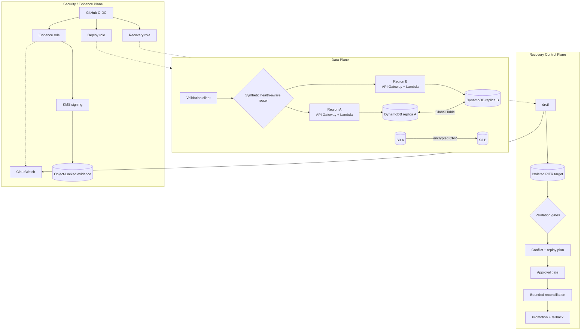
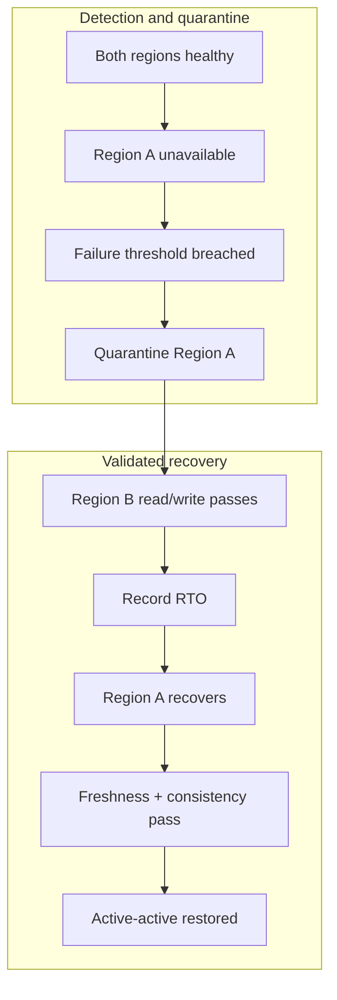
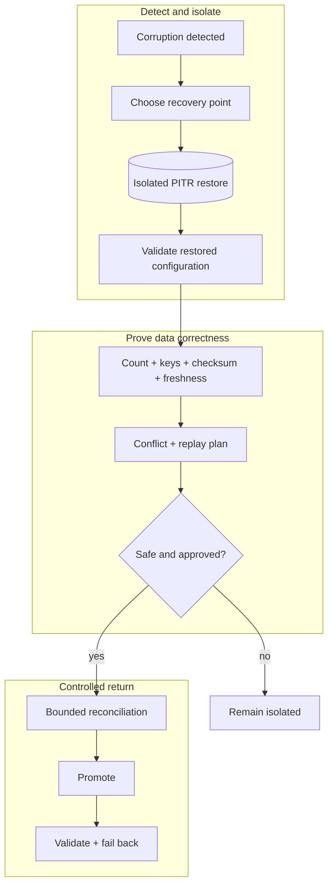
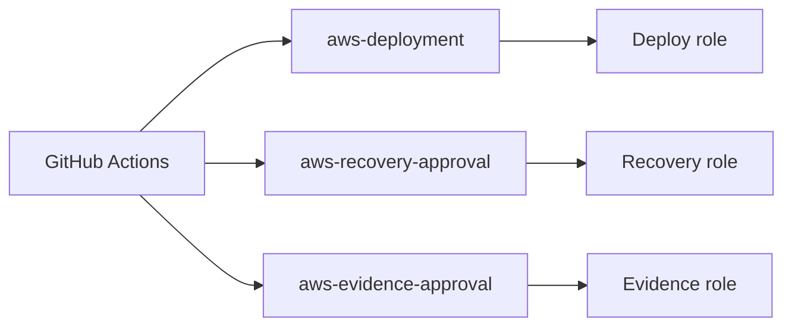

# Multi-Region Disaster Recovery & Recovery Validation Platform

[](https://github.com/Shaharyarzd/multiregion-disaster-recovery-platform/actions/workflows/ci.yml)

A serverless AWS case study that asks a harder question than “did failover work?”:

> Can an active-active application survive a regional endpoint outage, recover safely from logical
> corruption, prove data correctness before promotion, and measure actual RTO/RPO from trusted
> observations?

The implementation uses two regional HTTP APIs and Lambdas, DynamoDB Global Tables with PITR,
versioned S3 with encrypted cross-region replication, KMS, CloudWatch, Terraform, GitHub OIDC, and
a Python recovery controller named `drctl`. All application data is synthetic.

## Runtime proof

Milestone 2 executed the disposable two-region topology in `us-east-1` and `us-west-2`. The final
report was hash-chained, signed with an asymmetric AWS KMS key, verified after exact-version
read-back, and retained under S3 Object Lock.

| Proof | Observed result |
|---|---|
| Regional endpoint outage | **PASS** — survivor read/write continued; RTO **0.897355 seconds** |
| DynamoDB cross-region convergence | **837.783 ms** and **1394.320 ms** |
| Logical-corruption recovery | **PASS** — isolated PITR restore in **901.812355 seconds** |
| Data correctness and replay | **8/8 records**; **21 replayed**; retry **21/21 idempotent** |
| Safety and resume | conflict/staleness gates, conditional repair, crash/resume, and failback **PASS** |
| S3 CRR and version recovery | **PASS** — observed lag **23.813 seconds**, exact digest/version |
| CloudWatch contract | **PASS** — all nine DR metrics accepted and observed |
| Evidence and cleanup | KMS-signed Object Lock read-back **PASS**; disposable infrastructure removed |

> Measured RPO was conservatively bounded at **323.244–323.957 seconds**. Because DynamoDB Global
> Tables use last-writer-wins semantics, application timestamps were not treated as causal ordering
> evidence; the bound was derived from PITR readback and trusted AWS/controller observations.

Failed attempts and narrow IAM/runtime corrections remain in the signed audit trail. They were not
removed to manufacture a clean PASS. See [runtime evidence](docs/runtime-evidence.md).

## Architecture



The executed router is deliberately synthetic: it proves health-aware application behavior, not
DNS or anycast convergence. Route 53 with health-aware records/custom domains is the documented
production target. No paid global-routing service was used.

## Two distinct recovery problems

### Regional outage

The client quarantines an unavailable endpoint after a fixed failure threshold, validates a
deterministic write/read through the survivor, then requires fresh health and consistency evidence
before restoring active-active routing.



During the tiny outage detection/quarantine window, **2 of 4 requests failed**. Subsequent survivor
read/write validation succeeded and measured RTO remained **0.897355 seconds**. This was a bounded
recovery drill, not a production load test; the synthetic router does not prove Route 53, resolver,
or anycast convergence.

### Logical corruption

Global replication can copy corruption to every replica, so regional failover is insufficient.



The restored table never replaces production merely because AWS reports it `ACTIVE`. Promotion is
blocked by checksum/key-set/count failures, unresolved conflicts, incomplete replay, stale evidence,
unsafe newer writes, excessive replication lag, or failed restored-resource configuration checks.

## Recovery control plane

`drctl` implements an explicit state machine:

`HEALTHY → INCIDENT_DECLARED → RECOVERY_IN_PROGRESS → VALIDATING → AWAITING_APPROVAL →
RECOVERY_ACTIVE → FAILBACK_IN_PROGRESS → HEALTHY`

Automation handles restore, validation, replay planning, RTO/RPO, and evidence. Protected approval
is required for reconciliation, promotion, and failback. The portfolio run used a documented
self-review exception; production requires a reviewer other than the workflow initiator.

### Separation of duties



- The deploy role cannot execute PITR recovery, reconciliation, promotion, or failback.
- The approval-gated recovery role controls bounded production reconciliation and failback.
- The evidence role can sign and archive reports but cannot modify production data.

## Evidence model

`recovery-report.json` records timestamp authorities, raw measurements, lifecycle events,
approvals, validations, and replay outcomes in deterministic canonical JSON. Events form a hash
chain; the AWS report is KMS-signed and Object-Locked. Local evidence remains explicitly labeled
`LOCAL_SIMULATION` and is not described as immutable.

## Runtime engineering lessons

- API Gateway tag-on-create authorization required two-phase stage provisioning to preserve
  least privilege: create inert, tag and verify, then enable traffic.
- Global Table and PITR runtime IAM prerequisites surfaced beyond what static policy simulation
  could prove; each correction used the narrowest enforceable action/resource boundary.
- `RestoreTableToPointInTime` completion was treated as infrastructure readiness, never recovery
  success; configuration and data validation still had to pass.
- Object Lock evidence required exact-version read-back, digest comparison, retention inspection,
  and signature verification after download.
- Cleanup followed dependency order and retained only the locked evidence bucket and its required
  encryption/signing keys.

## Run locally

Requirements: Python 3.11+ and Terraform 1.8+.

```bash
python3 -m venv .venv
source .venv/bin/activate
python -m pip install -e '.[dev]'
make verify
make local-demo
```

No workflow performs an unattended cloud deployment. AWS deployment and recovery paths remain
manual, environment-protected, OIDC-authenticated, and owner-authorized.

Final CI: **84 tests**, **92.43% coverage**, strict mypy, Ruff, Terraform validation, workflow lint,
Trivy, and gitleaks.

## Design boundaries

- This is a bounded transaction-recovery demonstration, not a universal merge engine.
- Synthetic routing is not evidence of managed global DNS/anycast failover.
- Global Table LWW semantics prevent a claim of globally causal application timestamps.
- The production target uses independent reviewers, longer evidence retention, multi-vantage health
  checks, and organization-specific routing and reconciliation policy.
- No employer/customer architecture, names, code, credentials, secrets, or data are included.

## Documentation

[Architecture](docs/architecture.md) · [Scenarios](docs/disaster-scenarios.md) ·
[Orchestration](docs/recovery-orchestration.md) · [RTO/RPO](docs/rto-rpo.md) ·
[Reconciliation](docs/reconciliation-contract.md) · [Runtime evidence](docs/runtime-evidence.md) ·
[Security](docs/security-threat-model.md) · [Runbook](docs/runbook.md) · [ADRs](docs/adr/)

## Cost and teardown

The controlled run is estimated at **USD 1.50–3.00**, below the USD 10 ceiling. APIs, Lambdas,
DynamoDB tables/replicas, runtime S3 buckets, CloudWatch runtime resources, temporary IAM roles,
and recovery targets were removed. Only the Object-Locked evidence bucket and its required
encryption/signing keys remain intentionally; see the [cost model](docs/cost-model.md).
