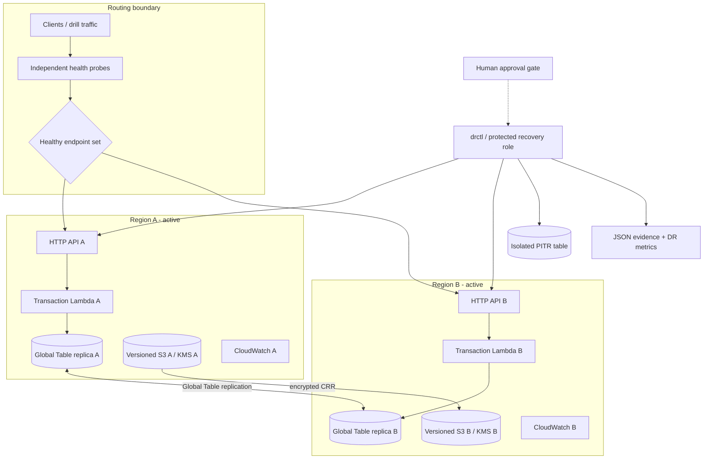

# Architecture

## Decision frame

The system keeps both regional APIs live and accepts writes in either region. DynamoDB Global
Tables resolve physical replication; application transaction IDs are deterministic and writes are
conditional, limiting duplicate creation. This is not a generic “promote secondary” design: during
a regional outage the failed endpoint is quarantined while the healthy endpoint remains active.
During logical corruption, both replicas may contain the bad write, so traffic failover is
insufficient—PITR restoration occurs into an isolated table.

## Failure semantics

- **Regional outage:** health requires API, read, and write probes. An unhealthy region is removed
  from the writable set. The survivor receives a deterministic synthetic transaction and reads it
  back. There is no singular leader flag to “promote,” so double-promotion is avoided; endpoint
  eligibility is health-evidence based and failed endpoints are quarantined.
- **Logical corruption:** Global Tables correctly replicate the corruption. The controller selects
  the latest safe point before the corruption, restores a differently named table, and denies
  promotion until key set, count, checksum, freshness, S3, and post-recovery transaction gates pass.
- **Failback:** the old region is never blindly reintroduced. API health, read/write tests,
  cross-region comparison, freshness, and approval are required before returning to `HEALTHY`.

## Routing truthfulness

The executable demo uses `SyntheticRouter`, a deterministic client-side endpoint selector that
removes failed endpoints. It proves application behavior and routing assertions in a reproducible,
low-cost test. It does **not** prove DNS propagation, anycast convergence, resolver caching, or
internet-path health. Production would use Route 53 health/evaluate-target routing plus ARC safety
rules, or Global Accelerator, WAF, custom domains, and multi-vantage probes.

## State ownership

| State | Owns | Failure blast radius |
|---|---|---|
| `bootstrap` | GitHub OIDC and deploy/recovery roles | identity only; rare changes |
| `global` | Global Table, PITR, KMS keys, S3/CRR | durable multi-region data plane |
| `region-a` | API, Lambda, role, logs, alarms, dashboard A | Region A runtime only |
| `region-b` | API, Lambda, role, logs, alarms, dashboard B | Region B runtime only |

Regional roots receive global outputs as explicit pipeline inputs. This permits independent plan
and recreation without granting every stack write access to shared state.

