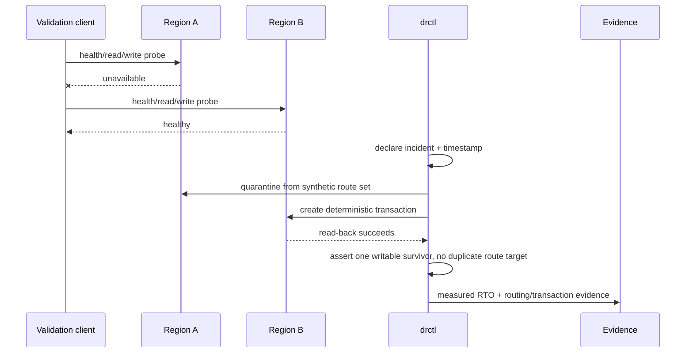
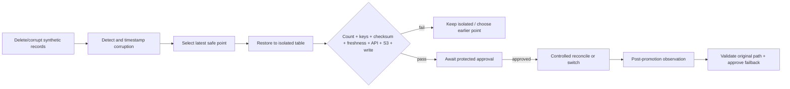

# Disaster scenarios

## Scenario 1: regional outage

Inject the failure only through the test harness in Milestone 1. In AWS, an owner-authorized drill
may disable the validation client’s Region A endpoint or use a scoped fault mechanism; it must not
destroy data. Success means the Region B read/write path is observed, the failed endpoint is
excluded, and the RTO clock stops at the first successful survivor transaction—not when an alarm
changes state.

## Scenario 2: logical DynamoDB corruption

The restored table is never named or wired as production during restore. “Amount lost” is the
missing expected key count; RPO is the corruption timestamp minus newest recovered transaction.
Unexpected keys also fail validation. Production reconciliation strategy—table switch, selective
copy, or immutable replay—must be chosen from the incident’s corruption scope.

## Scenario 3: S3 deletion/stale replica/version recovery

Upload only `examples/supporting-data`. Record source version IDs and SHA-256 values, verify the
replication status and destination version, then delete the current source version. The controller:

1. lists source and replica versions (delete markers included in evidence);
2. selects the last non-delete version before the incident;
3. copies it to a quarantine prefix/bucket, never over the live key;
4. checks bytes/checksum, encryption, metadata, and replica freshness;
5. requests approval before restoring the live key.

A missing/stale replica does not automatically fail DynamoDB recovery, but it fails the composite
application recovery gate when that object belongs to the expected manifest.

