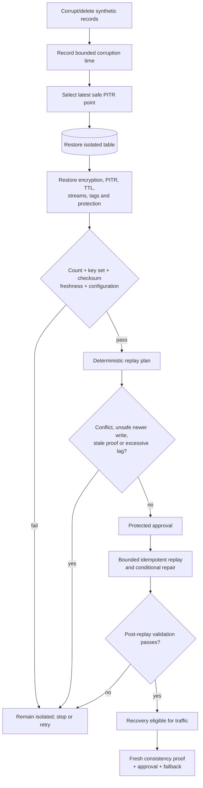

# Disaster scenarios

## Scenario 1: regional outage

```mermaid
sequenceDiagram
  participant C as Health-aware client
  participant A as Region A API
  participant B as Region B API
  participant D as drctl
  participant E as Evidence chain

  C->>A: health/read/write probe
  A--xC: endpoint unavailable
  C->>B: concurrent health/read/write probe
  B-->>C: healthy
  D->>D: declare incident (RTO start)
  D->>D: threshold reached; quarantine A
  D->>B: deterministic survivor write
  B-->>D: read-back validated (RTO end)
  D->>E: RTO + request outcomes
  D->>A: probe restored endpoint
  A-->>D: healthy
  D->>D: consistency + approval gate
  D->>E: active-active restored
```

The AWS drill made Region A unavailable to the validation client without destroying regional data.
Region B read/write remained available, the failed endpoint was excluded, and the RTO clock stopped
at the first successful validated survivor transaction—not when an alarm changed state. This
measured application recovery, not managed DNS or anycast convergence.

## Scenario 2: logical DynamoDB corruption



The restored table is never named or wired as production during restore. “Amount lost” is the
missing expected key count. RPO is a conservative interval between the bounded corruption
observation and newest validated PITR transaction; application timestamps do not establish causal
order under Global Table LWW semantics. Unexpected keys also fail validation. Production
reconciliation strategy—table switch, selective copy, or immutable replay—must be chosen from the
incident’s corruption scope.

## Scenario 3: S3 deletion/stale replica/version recovery

Upload only `examples/supporting-data`. Record source version IDs and SHA-256 values, verify the
replication status and destination version, then delete the current source version. The controller:

1. lists source and replica versions (delete markers included in evidence);
2. selects the last non-delete version before the incident;
3. copies it to a quarantine prefix/bucket, never over the live key;
4. checks bytes/checksum, encryption, metadata, and replica freshness;
5. requests approval before restoring the live key.

A missing/stale replica does not automatically fail DynamoDB recovery, but it fails the composite
application recovery gate when that object belongs to the expected manifest.
