# Recovery orchestration

## State machine

```mermaid
stateDiagram-v2
  [*] --> HEALTHY
  HEALTHY --> INCIDENT_DECLARED: declare + timestamp
  INCIDENT_DECLARED --> RECOVERY_IN_PROGRESS: start isolated recovery
  RECOVERY_IN_PROGRESS --> VALIDATING: restore/configuration ready
  VALIDATING --> RECOVERY_IN_PROGRESS: validation failed; retry safely
  VALIDATING --> AWAITING_APPROVAL: every gate passed
  AWAITING_APPROVAL --> RECOVERY_ACTIVE: separate promotion approval
  RECOVERY_ACTIVE --> FAILBACK_IN_PROGRESS: fresh consistency + approval
  FAILBACK_IN_PROGRESS --> RECOVERY_ACTIVE: failback proof failed/stale
  FAILBACK_IN_PROGRESS --> HEALTHY: both regions validated + approval

  note right of AWAITING_APPROVAL
    No implicit promotion
    No unresolved conflict
    Replay complete
    Validation fresh
  end note
```

The library rejects every absent edge. `AWAITING_APPROVAL` is reachable only when all fields of
`ValidationResult` pass. Promotion requires an approver and change/reference string. Failback adds
fresh health and data-consistency proof rather than reusing the promotion validation.

## Automated versus controlled

| Automated | Protected human control |
|---|---|
| discovery, timestamps, safe recovery-point selection | incident declaration |
| PITR to an isolated target and version selection | recovered-data promotion/reconciliation |
| health/read/write and deterministic comparison | entering failback |
| RTO/RPO and evidence generation/redaction | re-enabling both active regions |

AWS adapters expose narrow PITR and version-recovery calls. They deliberately do not encode a
generic production overwrite. The deployment role has an explicit deny for PITR and routing
changes; the recovery role is assumed only via the protected `aws-recovery-approval` environment.

## Validation contract

Every recovery requires API health, read/write, exact record count, exact expected key set,
deterministic content checksum, freshness, S3 expected versions, cross-region consistency, and a
new synthetic transaction after recovery. A check may be relaxed only by changing code and review,
never by editing the JSON evidence.
